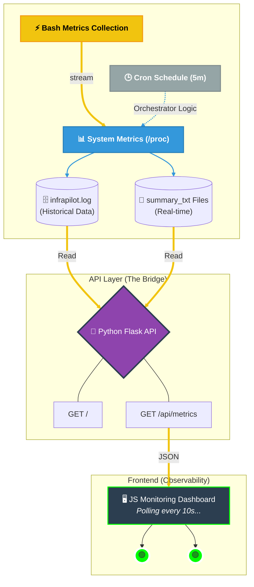

# 🛸 InfraPilot - A System Observatory
**A Lightweight, First-Principles Infrastructure and Observability Stack**

[](https://hub.docker.com/r/kulsum16/infrapilot)
[](https://opensource.org/licenses/MIT)

> "Understanding the 'why' before the 'how'." InfraPilot is a custom-built monitoring suite designed to bridge the gap between production operations and systems engineering by deconstructing how metrics are collected, processed, and visualized.

---
## 🏗 System Architecture

This diagram illustrates the end-to-end data flow—from raw kernel metrics to a containerized web dashboard.



# 🚀 The Mission
In an era of "black-box" monitoring tools, InfraPilot was built to deconstruct the observability pipeline. This project simulates the core mechanics of industry standards like Prometheus and Datadog by building them from the ground up.

## Why this matters for SRE:
• *System Visibility:* Transforming raw /proc and df data into structured JSON.

• *Automation Patterns:* Utilizing cron for reliable, decoupled data collection.

• *Container Lifecycle:* Fully containerized with Podman/Docker for reproducible deployments.

• *Edge Case Handling:* Built-in "Live Fallback" logic for when logs are stale or missing.

---
## 🧠Purpose

To simulate how monitoring systems:

- Collect system metrics

- Structure logs

- Automate execution

- Isolate runtime environments

- Present system state

This project emphasizes infrastructure thinking over tool usage.
---

## 🧱 Core Components

• Bash-based CPU & disk monitoring
• Structured log generation
• Cron-based automation
• Dockerized runtime
• Minimal frontend visualization.

---

## 📁 Repository Structure
```
scripts/ → Monitoring logic
logs/ → Generated log outputs
frontend/ → Dashboard UI
cheatsheets/ → Linux & backend references
Dockerfile → Container definition
mycron → Scheduled execution config
```
---

## 🛠️ Tech Stack

- **Operating System:** Linux  
- **Scripting:** Bash  
- **Version Control:** Git & GitHub  
- **Scheduling & Automation:** Cron  
- **Containerization:** Docker  
- **Orchestration:** Kubernetes 
- **CI/CD:** Jenkins + GitHub Webhooks  
- **Frontend:** HTML / CSS / JS 

---
## 📈 Project Status

- Phase 1: Local monitoring + containerization ✅
- Phase 2: Dashboard Optimization and Kubernetes deployment (in progress).
- Phase 3: CI/CD integration
- Phase 4: Health checks & alert simulation
  
---

## 🔗 Links

DockerHub: kulsum16

## 👤 Author

**Syeda Umme Kulsum**  
DevOps / SRE Engineer  <3


